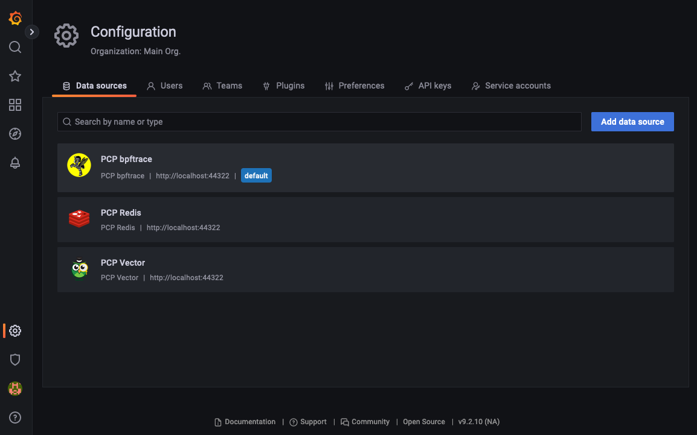
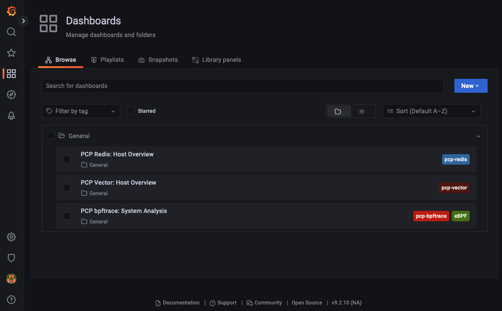
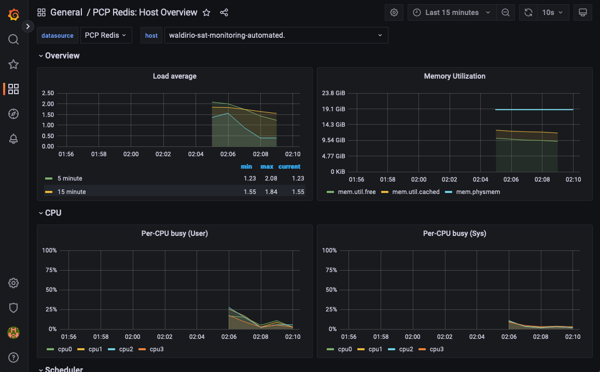

# sat_monitoring_install

## Disclaimer:
This playbook is not delivered and/or supported by Red Hat. This is just a play that was developed as POC and will help to improve the Red Hat Satellite product, via RFE (Request For Enhancement).

---

This playbook will deploy the complete monitoring tool, it will also do the initial configuration, and at the end of the run, you should be able to access the link `http://satellite_fqdn:3000`.

By default, the user and password is admin, and after the first login, it will be requested to update your password.

## Usage

On your Satellite Server, first, create a snapshot, after that, you should be ok to move on!
```
wget https://raw.githubusercontent.com/Qikfix/sat_monitoring_install/main/monitoring_install.yaml
ansible-playbook monitoring_install.yaml
```

Note that all the necessary setup will be done by the play, this includes the proper configuration of datasource, dashboard imports, and all the necessary settings, you just need to login with the `admin` account, using the `admin` password, and change in in the first login. After that, just access the dashboards available.

## Some Pictures







I hope you enjoy it!

Waldirio
